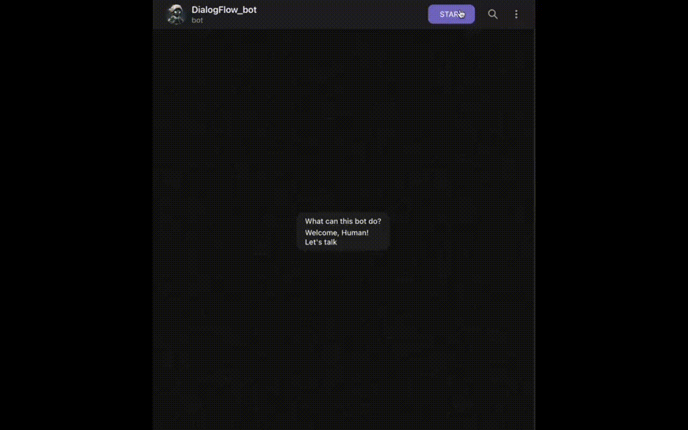
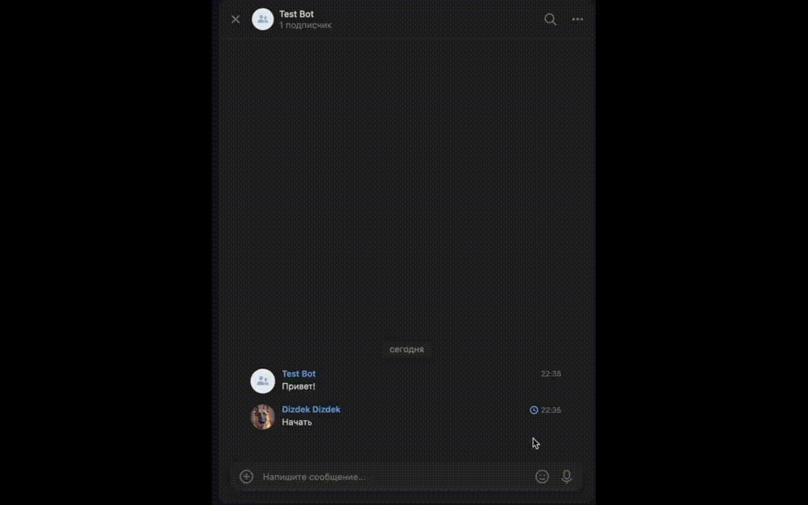

<h2 style="text-align:center">VK and Telegram bot integrated with dialogflow by Google</h2>

This bots are trained with limited amount of data and can answer to some of your certain questions.

---

<h2 style="text-align:center">Preview</h2>
<br>
<div style="display: flex; align-items: center; justify-content: space-around; flex-wrap: wrap; gap: 20px; padding: 20px;">
    <div style="flex: 1; min-width: 300px; text-align: center;">
        <h3>Telegram</h3>
        
    </div>
    <div style="flex: 1; min-width: 300px; text-align: center;">
        <h3>VK</h3>
        
    </div>
</div>
<br>
<h2 style="text-align:center">Environment</h2>

### Requirements

Python3 must already be installed in your environments. You may create an virtual environement as well to not trash your memory space.

- To run your bot correctly you should install next requirements to your env:

1. vk-api==11.9.9
2. requests==2.28.1
3. python-environ==0.4.54
4. python-telegram-bot==13.7
5. google-cloud-dialogflow==2.41.1

or just but the next line of code in your bash terminal:

```bash
  pip install -r requirements.txt
```

- In your created .env file you should add your apies

```bash
    TG_BOT_TOKEN=YOUR_DEVMAN_API
    VK_BOT_TOKEN=YOUR_TG_API
    PROJECT_ID=YOUR_DIALOGFLOW_AGENT_ID
    ADMIN_CHAT_ID_TG=YOUR_TG_CHAT_ID #optional
    ADMIN_CHAT_ID_VK=YOUR_VK_CHAT_ID #optional

```

---

<strong>1. TG_BOT_TOKEN and VK_BOT_TOKEN are needed to run your bots.</strong>
-For telegram bot you should go to @bot_father and create a new bot, then i will create a unique bot_token for that bot
-For VK bot you should create a communinity then create a bot, go to messages section in the right bar and choose the API
section the tab create token
<strong>2. ADMIN_CHAT_ID_TG and ADMIN_CHAT_ID_VK are needed to get the loggs</strong>
-Telegram:
To get your id you can take advantage of some bots inn telegram that will automatically define your id
-VK:
If you go to your profile then you can see https://vk.com/id123456789 in the search-bar - 123456789 - is your Id
<strong>3. PROJECT_ID is an id of your dialogflow agent.</strong>

---

**_NOTE:_**

1. To make it work please be asured that you:
   -Linked your Google project with dialogflow agent - they must have the same id.
   -Created the credentials, download then (it will be json file) and put the in the save place in your pc:
   -Export that credentials:

   ```bash
   nano ~/.zshrc

   export GOOGLE_APPLICATION_CREDENTIALS="/path/to/credentials.json"
   ```

   for more info please read the [documantation](https://cloud.google.com/dialogflow/docs)  
   <br>

2. To make your bots send you the loggs you should first start them, i.e. start the conversation with them first otherwise
   they will not reply you 🙂‍↔️
   <br>

<h2 style="text-align:center">Run</h2>

Telegram_bot:

```bash
    python tg_bot.py
```

VK bot:

```bash
    python vk_bot.py
```

You will see something like following:

2025-03-07 12:27:10,912 - INFO - Бот активирован

2025-03-07 12:27:10,913 - INFO - ...
<br>

<h2 style="text-align:center">Features</h2>
To add the intents and train your bot faster you can add a file in the format of json and call it <strong>phrases.json</strong>. The structure of your json file must be following:

```json
{
  "name_of_intent": {
    "questions": [],
    "answer": ""
  },
  "name_of_intent": {
    "questions": [],
    "answer": ""
  }
}
```

Then you can just run next command and it will keep in mind that intents 🥸

```bash
python download_phrases.py
```

<h3>Done!</h3>

<br>
<h2 style="text-align:center">Project Goals</h2>

The code is written to automate the proccess of answering to FAQ
# Smart-bot
